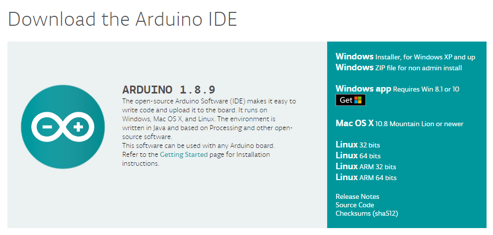

# 環境構築

ここでは，開発環境の構築をしていきます(とりあえずWindows向け)．

環境構築といってもとても簡単で，Arduino IDEをインストールするだけです．

## Arduino IDEのダウンロード

まずは，[Arduinoのサイト](https://www.arduino.cc)にアクセスしましょう．
"SOFTWARE"を選ぶと，以下のようなArduino IDEをダウンロードするところがあります．

今回はWindowsでの環境構築なので，"Windows Installer"を選択して下さい．
学校のパソコンや家のパソコンなど，自分のアカウントに管理者権限が無い場合は2番目の"Windows ZIP file"を選択して下さい．
Windows8.1やWindows10を使っている人は"Windows app"でもよいです(もしかしたらこちらの方が良いかもしれません)．

すると，このような画面になるので，"JUST DOWNLOAD"をクリックして下さい．
でも，「Arduinoは神！！！！募金したい！！！！」という強い意志がある人はぜひ，
"CONTRIBUTE & DOWNLOAD"をクリックして募金しましょう．
クレジットカードかPayPalで好きな金額を募金することができます．
